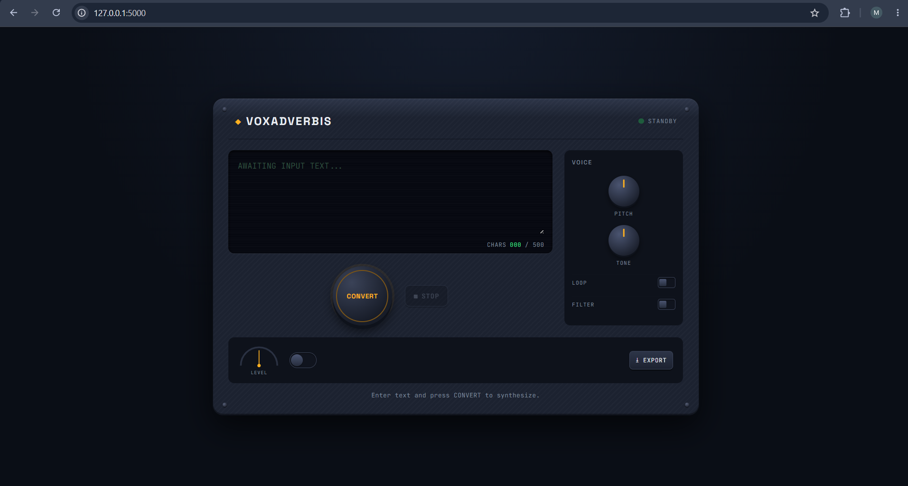

# 🛰️ Voxadverbis
 
A text-to-speech console with a **skeuomorphic spacecraft-cockpit UI**. Type a message, hit **CONVERT**, and Voxadverbis synthesizes it to speech and plays it back right in the browser — styled like a retro sci-fi synth/mixing console.
 

 
## ✨ Features
 
- 🎙️ **Text-to-speech synthesis** — type up to 500 characters and convert them to audio in one click
- 🖥️ **CRT-style terminal screen** with a live character counter (`CHARS 000 / 500`)
- 🟢 **Status indicator** — shows `STANDBY` when the system is idle, with live status updates during synthesis
- 🔊 **Playback controls** — `CONVERT` to generate and play, `STOP` to halt playback
- 🎛️ **Voice panel** — analog `PITCH` and `TONE` knobs, plus `LOOP` and `FILTER` toggles for shaping the output
- 📊 **Level gauge** — analog VU-style needle showing output level
- 📤 **Export button** — download the generated audio
- 🎨 Fully themed console aesthetic — analog knobs, glowing indicators, and a dark synth-rack layout
## 🧰 Tech Stack
 
- **Backend:** Python, Flask
- **Speech synthesis:** [gTTS](https://pypi.org/project/gTTS/) (Google Text-to-Speech)
- **Frontend:** HTML, CSS, JavaScript (Flask templates)
## 📂 Project Structure
 
```
voxadverbis/
├── app.py              # Flask app — serves the UI and handles /convert
├── templates/
│   └── index.html      # COMLINK console UI
├── audio_cache/         # Generated speech files (created at runtime)
└── .gitignore
```
 
## ⚙️ How It Works
 
1. The user types a message into the console screen and presses **CONVERT**.
2. The frontend sends the text to the Flask backend via a `POST` request to `/convert`.
3. The backend generates an MP3 using `gTTS`, saves it to `audio_cache/`, and streams it back.
4. The browser plays the returned audio directly, and it can be downloaded via **EXPORT**.
## 🚀 Getting Started
 
### Prerequisites
- Python 3.8+
- pip
### Installation
 
```bash
# Clone the repository
git clone https://github.com/imohitparkash/voxadverbis.git
cd voxadverbis
 
# Install dependencies
pip install flask gtts
 
# Run the app
python app.py
```
 
The app will start on `http://127.0.0.1:5000`. Open it in your browser and start transmitting.
 
## 🗺️ Roadmap / Ideas
 
- [ ] Wire up `PITCH`, `TONE`, `LOOP`, and `FILTER` controls to actual audio processing
- [ ] Multiple voice/language options
- [ ] Persistent synthesis history/log
- [ ] Real-time level meter driven by actual audio output
## 📄 License
 
This project is licensed under the [MIT License](LICENSE).
 
---
 
Built by [Mohit Parkash](https://github.com/imohitparkash)
 

